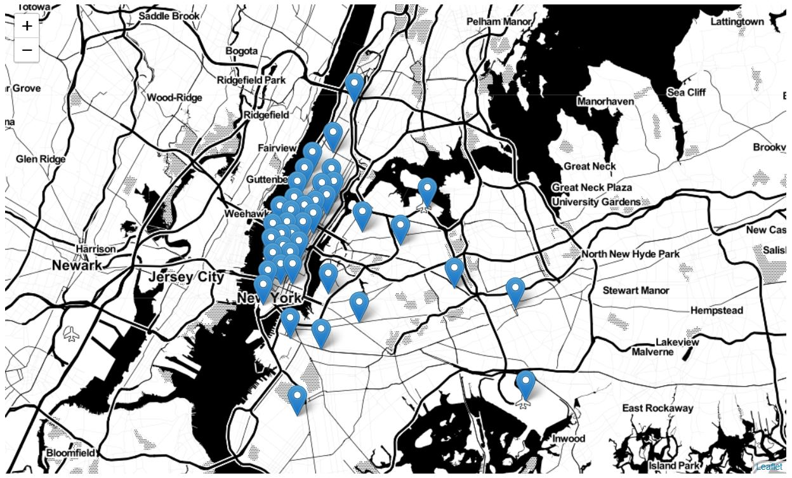

# Taxi-demand-prediction-in-New-York-City
Given a region in a map, our task is to predict the number of pickups in a 10 minute interval. Support we are at time t, we will use all the data till time (t-1) to predict the pickup at time t.

# Data Information

Ge the data from : http://www.nyc.gov/html/tlc/html/about/trip_record_data.shtml (2016 data)
The data used in the attached datasets were collected and provided to the NYC Taxi and Limousine Commission (TLC) 

## Information on taxis:

<h5> Yellow Taxi: Yellow Medallion Taxicabs</h5>

 These are the famous NYC yellow taxis that provide transportation exclusively through street-hails. The number of taxicabs is limited by a finite number of medallions issued by the TLC. You access this mode of transportation by standing in the street and hailing an available taxi with your hand. The pickups are not pre-arranged.

<h5> For Hire Vehicles (FHVs) </h5>

 FHV transportation is accessed by a pre-arrangement with a dispatcher or limo company. These FHVs are not permitted to pick up passengers via street hails, as those rides are not considered pre-arranged. 

<h5> Green Taxi: Street Hail Livery (SHL) </h5>

  The SHL program will allow livery vehicle owners to license and outfit their vehicles with green borough taxi branding, meters, credit card machines, and ultimately the right to accept street hails in addition to pre-arranged rides. 

 Credits: Quora

<h5>Footnote:</h5>
In the given notebook we are considering only the yellow taxis for the time period between Jan - Mar 2015 & Jan - Mar 2016

### Objective this case study:

From a taxi driver point of view, the main objective of this case study is to predict the number of pickups or to maximize the number of pickups in a particular region in a future 10 minute interval. If I have 5 segmented regions in a map A,B,C,D,E and at a given time I am region C, I want to understand which of the other 4 regions will give me the most number of pickups. I will have to accurately predict which what will be the number of pickups in each region, so that I can move my taxi to that region. Let's see this with an example.

If a taxi driver knows in advance which regions will have more pickups at a given time interval, he can move his taxi to that region in order to maximize his pickups which in turn maximizes his revenue. In this case study we are building a time series forcasting model which predicts the number of pickups.

The end use for this case study will be taxi/cab drivers who would want to benefit from the advancements in Machine Learning.

We will break the New York City into certain regions based on certain conditions. We will also break the entire time span into a 10 min time interval. In this way, given a location information, it will be easier for the model to suggest a location to the taxi driver. 

IN terms of interpretability, it is not so much important. Because if we think about it carefully, we do not want to know why the model has predicted 10 pickups instead of 13, or 15 pickups instead of 12. Because it doesn't make total sense. We jus want to know the fact that there will be 10 pickups and that's it. In terms of latency, a few seconds is ok. As long as it has a test runtime of few seconds it is ok. It should not take a few minutes. Because, we don't want the model to predict in say 2 minutes time. In that way we are already losing 2 minutes from a 10 minute window. 

### Constraints: 

We will primarily stick to median absolute percentage error as our key performance indicator. For this problem we will consider relative error and not absolute error. Let's look at a simple example, suppose the predicted value of the number of pickups in a scenario is 55, whereas the actual value is 50. In an other case, suppose the predicted number of pickups is 5 and the actual number of pickup is 10. In both the cases, the absolute error is the same - that is 5. However, the relative error for case 1 is much lesser than in case 2. In case it is 10%. In case 2, it is 50%. Massive difference!

# Data Collection
We Have collected all yellow taxi trips data from jan-2015 to dec-2016(Will be using only 2016 data in this assignment and test it on 2018 data.)
<table>
<tr>
<th> file name </th>
<th> file name size</th>
<th> number of records </th>
<th> number of features </th>
</tr>
<tr>
<td> yellow_tripdata_2016-01 </td>
<td> 1. 59G </td>
<td> 10906858 </td>
<td> 19 </td>
</tr>

<tr>
<td> yellow_tripdata_2016-02 </td>
<td> 1. 66G </td>
<td> 11382049 </td>
<td> 19 </td>
</tr>
<tr>
<td> yellow_tripdata_2016-03 </td>
<td> 1. 78G </td>
<td> 12210952 </td>
<td> 19 </td>
</tr>
<tr>
<td> yellow_tripdata_2016-04 </td>
<td> 1. 74G </td>
<td> 11934338 </td>
<td> 19 </td>
</tr>

<tr>
<td> yellow_tripdata_2016-05 </td>
<td> 1. 73G </td>
<td> 11836853 </td>
<td> 19 </td>
</tr>

<tr>
<td> yellow_tripdata_2016-06 </td>
<td> 1. 62G </td>
<td> 11135470 </td>
<td> 19 </td>
</tr>

<tr>
<td> yellow_tripdata_2016-07 </td>
<td> 884Mb </td>
<td> 10294080 </td>
<td> 17 </td>
</tr>

<tr>
<td> yellow_tripdata_2016-08 </td>
<td> 854Mb </td>
<td> 9942263 </td>
<td> 17 </td>
</tr>

<tr>
<td> yellow_tripdata_2016-09 </td>
<td> 870Mb </td>
<td> 10116018 </td>
<td> 17 </td>
</tr>

<tr>
<td> yellow_tripdata_2016-10 </td>
<td> 933Mb </td>
<td> 10854626 </td>
<td> 17 </td>
</tr>
<tr>
<td> yellow_tripdata_2016-11 </td>
<td> 868Mb </td>
<td> 10102128 </td>
<td> 17 </td>
</tr>
<tr>
<td> yellow_tripdata_2016-12 </td>
<td> 897Mb </td>
<td> 10449408 </td>
<td> 17 </td>
</tr>
<tr>
<td> yellow_tripdata_2015-01 </td>
<td> 1.84Gb </td>
<td> 12748986 </td>
<td> 19 </td>
</tr>
<tr>
<td> yellow_tripdata_2015-02 </td>
<td> 1.81Gb </td>
<td> 12450521 </td>
<td> 19 </td>
</tr>
<tr>
<td> yellow_tripdata_2015-03 </td>
<td> 1.94Gb </td>
<td> 13351609 </td>
<td> 19 </td>
</tr>
<tr>
<td> yellow_tripdata_2015-04 </td>
<td> 1.90Gb </td>
<td> 13071789 </td>
<td> 19 </td>
</tr>
<tr>
<td> yellow_tripdata_2015-05 </td>
<td> 1.91Gb </td>
<td> 13158262 </td>
<td> 19 </td>
</tr>
<tr>
<td> yellow_tripdata_2015-06 </td>
<td> 1.79Gb </td>
<td> 12324935 </td>
<td> 19 </td>
</tr>
<tr>
<td> yellow_tripdata_2015-07 </td>
<td> 1.68Gb </td>
<td> 11562783 </td>
<td> 19 </td>
</tr>
<tr>
<td> yellow_tripdata_2015-08 </td>
<td> 1.62Gb </td>
<td> 11130304 </td>
<td> 19 </td>
</tr>
<tr>
<td> yellow_tripdata_2015-09 </td>
<td> 1.63Gb </td>
<td> 11225063 </td>
<td> 19 </td>
</tr>
<tr>
<td> yellow_tripdata_2015-10 </td>
<td> 1.79Gb </td>
<td> 12315488 </td>
<td> 19 </td>
</tr>
<tr>
<td> yellow_tripdata_2015-11 </td>
<td> 1.65Gb </td>
<td> 11312676 </td>
<td> 19 </td>
</tr>
<tr>
<td> yellow_tripdata_2015-12 </td>
<td> 1.67Gb </td>
<td> 11460573 </td>
<td> 19 </td>
</tr>
</table>

### Note: 
When we try to load a csv, pandas loads the entire csv into the RAM before we are able to use it. Dask dataframes does not do this. It loads the data block by block. A large csv file is represented as a block of files in the filesystem. Pandas loads all the block all at once to RAM. Dask loads only those file system which are needed right now. It will load the 4 blocks into RAM, after it has done processing the 4 blocks, it will remove them from memory and start processing the next 4 blocks in queue until the processing of all the blocks are completed. 

# ML Problem Formulation

<b> Time-series forecasting and Regression</b>

Given a region (latitude and longitudes) and a 10 minute interval, we have to predict the number of pickups in that region.  The big question is how do we break up New York City into regions? If we see the graph of number of pickups which happened during the entire day, we will be able to see some repeating patterns in them. Our task is to leverage the repeating patterns in order to extract more information from the data. Our raw data will be latitude and longitude, by which we will use some groupby operation to segregate the data based on 10min time bins. Suppose I have data till time t, I need to predict the outcome at time t+1. 

# Performance metrics
1. Mean Absolute percentage error.
2. Mean Squared error.

MAPE basically gives us the relative error, which makes more sense than using absolute error. This is important when we try to assess a models performance. MAPE is used to quantify our predictions. It's just like having a confidence interval.

## Data Cleaning

In this section we will be doing univariate analysis and removing outlier/illegitimate values which may be caused due to some error. We need to feed our model with clean data if we want them to train well. 

It is inferred from the source https://www.flickr.com/places/info/2459115 that New York is bounded by the location cordinates(lat,long) - (40.5774, -74.15) & (40.9176,-73.7004) so hence any cordinates not within these cordinates are not considered by us as we are only concerned with pickups which originate within New York. We will remove all such points from the data which have it's pickup of drops outside the city limits!

### New york bounding box:

1. min_lat <- 40.5774
2. max_lat <- 40.9176
3. min_long <- -74.15
4. max_long <- -73.7004

# Data-preperation
## Clustering/Segmentation

1. Here the task is to break NYC into regions, i.e. break down or cluster NYC based on groups of latitudes and longitudes. 
2. Once we have the clusters ready, we will break the time data into bins of 10 minute intervals. For each region and each 10 minute bin, we have to estimate the number of pickups. 
3. We will use k means to cluster the city map into regions based on pickup densities. We will use latitudes and longitude data for this purpose and build the clusters in such a way that the minimum inter cluster distance has to be approximately 0.5 mile and the maximum intercluster distance will be 2 mile. Because a car can travel apprix 2 miles in 10 minutes. 
4. K means always tends to create clusters of equal size. Here size does not represent the physical dimensions by regions. Also, if a cluster is more dense it means there are more pickups in the region and of the cluster is less dense or widely spread, it means that the number if pickups in the region/cluster is very less. (We will apply k means on latitude and longitude vs number of pickups). The k means algorithm breaks NYC on the basis of the numebr of pickups. 

Lastly while breaking NYC into clusters we need to keep in mind that we need to find a trade off such that the centroids are typically 2 miles away at large and 0.5 miles away at minimum. 

### Cluster Centers

          
### Cluster Regions

The clusters are divided in such a way that dense regions has most pickups and sparse regions has less number of pickups. If ntice carefully, the region around the central park has more number of pickups which is very evident since central park is like the heart of the city. Most of the offices in NYC lie around the central park regions. We can also see that some small regions in Manhattan are extremely dense as compared to some of the other large regions outside Manhattan. 

## Time-binning

We will build bins of intervals 10 min each. Unix Time Stamp: No of seconds passed since the midnight of Jan 1,1970. We will take a given time, convert it to unix time stamp and divide it by 600(seconds) bins. Now that we have both the clusters and bns ready, we will make predictions. 

## Smoothing

If we notice carefully some 10 minute intervals has 0 pick ups. 0 is not very relevant when we train the model. So instead of keeping those values as it is, we will smooth them. The process is as follows. We have time binned regions of 10 minute intervals. Let's take three continuos intervals and let's say each of the intervals have 50,100 and 0 pickups respectively. Instead of taking 0 as the third value we will take the take the average of all the values and distribute it in the three regions as 50,50,50. In this way, each 30 minute interval will have the same number of pickups even though the pickups values changes in each of the three 10 minute interval.

 ## Time series and Fourier Transforms

Time Series: In the below graph, we can see repeated patterns like each day the number of cabs are highest during the office hours. It's least during midnight and increases as the day progresses. It decreases during noon time. Then again starts increasing during evening time. We will explore all such data dependendies using Fourier transformed features. 

Fourier transform generally means decomposition of a wave into sum of multiple sine waves. Whenever there is are repeated patterns in data, we can leverage the most out of them by using Fourier transform. Using fourier transform we can decompose any given waveform(or a function) into it's constituent frequencies. The graph obtained after fourier transform will have unique frequencies and amplitudes corresonding to their most frequent occurences in the original wave. 

Each fourier transformed features are basically multiple sine waves. Each sine wave has a specific time period, frequency and amplitude. From the time period we can easily get the frequencies for each of the sine waves. We are basically converting the time series data from time domain to frequency domain. We will plot these frequencies and it's corresponding amplitudes in a fourier transformed graph. The X axis will represent the frequencies of the sine waves and the Y axis will represent the correspondin amplitudes.

Whenever we have repeated patterns in our data we can explore them using fourier transformation and use them as features. Because they help us understand the hidden repeated patterns which can be very useful for extracting important features from the data. 

### Observation:

In the above graphs we have converted the data from a time-domain representation to a frequency domain representation. In this way we are able to extract information from the data. In the fast fourier transformation graph we have multiple frequencies shown in the order of their importance. The pattern which is most repeated will have maximum number of frequencies. We will also have a corresponding amplitude to these frequencies. We will take the most occuring frequencies and their corresponding amplitude as features in our data. 

In the graph we will have peaks approximately at the 1/144 region, 1/288 region and so on. It is the frequency at which the wave is changing. Here 1/144 corresponds to the daily patters in our data. 1/288 corresponds to maybe quaterly hour patterns. Like the daily patterns of office time, lunch time, school time and so on. There are number of these patterns whcih can be explored. Amplitudes measures how significant the corresponding frequencies are with respect to others. Higher the amplitude, higher will be the frequencies, and more important will be the information. Higher amplitude means we are extracting the most important features from the time series. 

We will take the time series data, transform them using fourier transformation, get the 5 frequencies with most amplitudes and use them as features while training our model. Fourier features are generall considered to be very good in time series problems. 

### Note about DC component.

If we take a closer look at the waves, we can see that the Y axis of teh waves are not centered at zero. The wave is centered around some ther value and oscillating around it. Due to this, during fast fourier transform we will aslo get a peak 0 (corresponding to the fact that the wave is not centered at 0). This peak is called a DC component. DC componenet tells us that the wave is not centered at zero. 

Peak at zero ===> DC Component.
Peak at 1/144 ===> Daily variation.
Peak at 1/188 ===> Morning + Evening peak hours variation and so on. 

## Modelling: Baseline Models

Now we get into modelling in order to forecast the pickup densities for the months of Jan, Feb and March of 2016 for which we are using multiple models with two variations 
1. Using Ratios of the 2016 data to the 2015 data i.e $\begin{align} R_{t} = P^{2016}_{t} / P^{2015}_{t} \end{align}$
2. Using Previous known values of the 2016 data itself to predict the future values

Typically time series are broken into windows and we will use the windows at the previous time intervals to predict the outcome at a future time interval. For each cluster we will have a time series. If we compare between two days exactly one year appart(like 15th Jan 2015 and 15th Jan 2016), we can get the Ratio feature, then use this ratio feature to predict the outcome for 16th jan 2016. We will use the recent ratio values to make predictions. There are various ways by which we can explore these ratio features. Using moving averages, using weighted moving averages, using exponential smoothing etc. We will use some ratio and previous value features to make some baseline models and compute their MAPE. This will give us an idea about the upper limit for the MAPE. In simple words we willuse data till time t-1 to predict the result at time t.

### Simple Moving Averages
The First Model used is the Moving Averages Model which uses the previous n values in order to predict the next value   

Using Ratio Values - $\begin{align}R_{t} = ( R_{t-1} + R_{t-2} + R_{t-3} .... R_{t-n} )/n \end{align}$

For the above the Hyperparameter is the window-size (n) which is tuned manually and it is found that the window-size of 3 is optimal for getting the best results using Moving Averages using previous Ratio values therefore we get $\begin{align}R_{t} = ( R_{t-1} + R_{t-2} + R_{t-3})/3 \end{align}$

Next we use the Moving averages of the 2016  values itself to predict the future value using $\begin{align}P_{t} = ( P_{t-1} + P_{t-2} + P_{t-3} .... P_{t-n} )/n \end{align}$

### Weighted Moving Averages
The Moving Avergaes Model used gave equal importance to all the values in the window used, but we know intuitively that the future is more likely to be similar to the latest values and less similar to the older values. Weighted Averages converts this analogy into a mathematical relationship giving the highest weight while computing the averages to the latest previous value and decreasing weights to the subsequent older ones 

Weighted Moving Averages using Ratio Values - $\begin{align}R_{t} = ( N*R_{t-1} + (N-1)*R_{t-2} + (N-2)*R_{t-3} .... 1*R_{t-n} )/(N*(N+1)/2) \end{align}$

The problem with simple moving average approach is that it gives equal priorities to all the previous time intervals. So we will use weghted moving average because by using weighted moving average we can give most importance to the time-series data which is most recent and reduce the importance for time-series data which has occured a few time steps back. 

The value of N is often determined using hyperparameter search and tuning. 

For the above the Hyperparameter is the window-size (n) which is tuned manually and it is found that the window-size of 5 is optimal for getting the best results using Weighted Moving Averages using previous Ratio values therefore we get $\begin{align} R_{t} = ( 5*R_{t-1} + 4*R_{t-2} + 3*R_{t-3} + 2*R_{t-4} + R_{t-5} )/15 \end{align}$

Weighted Moving Averages using Previous 2016 Values - $\begin{align}P_{t} = ( N*P_{t-1} + (N-1)*P_{t-2} + (N-2)*P_{t-3} .... 1*P_{t-n} )/(N*(N+1)/2) \end{align}$

### Exponential  Weighted Moving Averages
 https://en.wikipedia.org/wiki/Moving_average#Exponential_moving_average
Through weighted averaged we have satisfied the analogy of giving higher weights to the latest value and decreasing weights to the subsequent ones but we still do not know which is the correct weighting scheme as there are infinetly many possibilities in which we can assign weights in a non-increasing order and tune the the hyperparameter window-size. To simplify this process we use Exponential Moving Averages which is a more logical way towards assigning weights and at the same time also using an optimal window-size.

In exponential moving averages we use a single hyperparameter alpha $\begin{align}(\alpha)\end{align}$ which is a value between 0 & 1 and based on the value of the hyperparameter alpha the weights and the window sizes are configured. 
For eg. If $\begin{align}\alpha=0.9\end{align}$ then the number of days on which the value of the current iteration is based is~$\begin{align}1/(1-\alpha)=10\end{align}$ i.e. we consider values 10 days prior before we predict the value for the current iteration. Also the weights are assigned using $\begin{align}2/(N+1)=0.18\end{align}$ ,where N = number of prior values being considered, hence from this it is implied that the first or latest value is assigned a weight of 0.18 which keeps exponentially decreasing for the subsequent values.

Can I use my prediction at time t-1 to improve my predcition at time t? Yes we can. EWMA is the answer. 

$\begin{align}R^{'}_{t} = \alpha*R_{t-1} + (1-\alpha)*R^{'}_{t-1}  \end{align}$

$\begin{align}P^{'}_{t} = \alpha*P_{t-1} + (1-\alpha)*P^{'}_{t-1}  \end{align}$

## Feature Engineering Section 1: 

## Task 1: Incorporating Fourier transform features.

#### Time series and Fourier Transforms

Time Series: In the below graph, we can see repeated patterns like each day the number of cabs are highest during the office hours. It's least during midnight and increases as the day progresses. It decreases during noon time. Then again starts increasing during evening time. We will explore all such data dependendies using Fourier transformed features. 

Fourier transform generally means decomposition of a wave into sum of multiple sine waves. Whenever there is are repeated patterns in data, we can leverage the most out of them by using Fourier transform. Using fourier transform we can decompose any given waveform(or a function) into it's constituent frequencies. The graph obtained after fourier transform will have unique frequencies and amplitudes corresonding to their most frequent occurences in the original wave. 

Each fourier transformed features are basically multiple sine waves. Each sine wave has a specific time period, frequency and amplitude. From the time period we can easily get the frequencies for each of the sine waves. We are basically converting the time series data from time domain to frequency domain. We will plot these frequencies and it's corresponding amplitudes in a fourier transformed graph. The X axis will represent the frequencies of the sine waves and the Y axis will represent the correspondin amplitudes.

Whenever we have repeated patterns in our data we can explore them using fourier transformation and use them as features. Because they help us understand the hidden repeated patterns which can be very useful for extracting important features from the data. 

#### Observation:

In the above graphs we have converted the data from a time-domain representation to a frequency domain representation. In this way we are able to extract information from the data. In the fast fourier transformation graph we have multiple frequencies shown in the order of their importance. The pattern which is most repeated will have maximum number of frequencies. We will also have a corresponding amplitude to these frequencies. We will take the most occuring frequencies and their corresponding amplitude as features in our data. 

In teh graph we will have peaks approximately at the 1/144 region, 1/288 region and so on. It is the frequency at which the wave is changing. Here 1/144 corresponds to the daily patters in our data. 1/288 corresponds to maybe quaterly hour patterns. Like the daily patterns of office time, lunch time, school time and so on. There are number of these patterns whcih can be explored. Amplitudes measures how significant the corresponding frequencies are with respect to others. Higher the amplitude, higher will be the frequencies, and more important will be the information. Higher amplitude means we are extracting the most important features from the time series. 

We will take the time series data, transform them using fourier transformation, get the 5 frequencies with most amplitudes and use them as features while training our model. Fourier features are generall considered to be very good in time series problems. 

#### Note about DC component.

If we take a closer look at the waves, we can see that the Y axis of teh waves are not centered at zero. The wave is centered around some ther value and oscillating around it. Due to this, during fast fourier transform we will aslo get a peak 0 (corresponding to the fact that the wave is not centered at 0). This peak is called a DC component. DC componenet tells us that the wave is not centered at zero. 

Peak at zero ===> DC Component.
Peak at 1/144 ===> Daily variation.
Peak at 1/188 ===> Morning + Evening peak hours variation and so on.

## Feature Engineering Section 2: 

## Task 2: Incorporating Double + Tripple Exponential Smoothing

### Double Exponential Smoothing

<b>Double exponential smoothing</b> is applying exponential smoothing to level and trends. The code references is used from the above link.

The code is used from: https://grisha.org/blog/2016/02/16/triple-exponential-smoothing-forecasting-part-ii/

### Triple Exponential Smoothing

<b>Holt-Winters tripple exponential smoothing</b> is considered to be a benchmark algorithm in time series forcasting problems, particularly in problems where it has seasonal trends and variations in addition to level and trends, i.e. patterns which are very repeatative. 

<b>Season: </b> "If a series appears to be repetitive at regular intervals, such an interval is referred to as a season, and the series is said to be seasonal"

<b>Season Length: </b> "Season length is the number of data points after which a new season begins."

<b>Seasonal component: </b> "The seasonal component is an additional deviation from level + trend that repeats itself at the same offset into the season. There is a seasonal component for every point in a season, i.e. if your season length is 12, there are 12 seasonal components. We will use s to denote the seasonal component."

"The idea behind triple exponential smoothing is to apply exponential smoothing to the seasonal components in addition to level and trend. The smoothing is applied across seasons, e.g. the seasonal component of the 3rd point into the season would be exponentially smoothed with the the one from the 3rd point of last season, 3rd point two seasons ago, etc. In math notation we now have four equations." 

The code and references used are from this blog: https://grisha.org/blog/2016/02/17/triple-exponential-smoothing-forecasting-part-iii/

### What we did so far? 

The major task of this case study was to predict the number of pickups given a region and a time interval as our query point. We needed to determine the number of pickups with high accuracy and a low relative error. The model should be able to generate a response within a couple of seconds. Interpretability is not important. Because we don't really want to know why the model has predicted the value to be 50 or 60. We are satisfied as long as the result is given within a few seconds. 

The dataset that was used for analysis was Jan 2015. We have used dask dataframes rather than uisng pandas. Dask dataframes are good from memory optimization point of view because they operate block by block on the file system rather than loading the ntire data into RAM all at once. At first we will proceed with the cleaning of data. We will remove outliers on the basis of trip times, trip speed, trip distance, erroneous drop up and pick up locations etc. This step is important because we don't want these sort of outliers to impact our model.

After this stage, we will move on to segmenting the data into clusters based on pickup densities in a region. We will break NYC into regions based on daily pickups and also bin each of the regions into 10 minute time intervals. We will do the clustering using K-means. We have decided the right K using the two simple rules - we want our minimum inter-cluster distance to be 0.5. And we want our maximum inter-cluster distance to be 2 miles. The data is binned into 10 minute time time intervals. After this, the data is smoothed because we dont want our pickup values to have 0 pickups while training. 

If we notice carefully some 10 minute intervals has 0 pick ups. 0 is not very relevant when we train the model. So instead of keeping those values as it is, we will smooth them. The process is as follows. We have time binned regions of 10 minute intervals. Let's take three continuos intervals and let's say each of the intervals have 50,100 and 0 pickups respectively. Instead of taking 0 as the third value we will take the take the average of all the values and distribute it in the three regions as 50,50,50. In this way, each 30 minute interval will have the same number of pickups even though the pickups values changes in each of the three 10 minute interval.

Time Series: In the below graph, we can see repeated patterns like each day the number of cabs are highest during the office hours. It's least during midnight and increases as the day progresses. It decreases during noon time. Then again starts increasing during evening time. We will explore all such data dependendies using Fourier transformed features. 

Fourier transform generally means decomposition of a wave into sum of multiple sine waves. Whenever there is are repeated patterns in data, we can leverage the most out of them by using Fourier transform. Using fourier transform we can decompose any given waveform(or a function) into it's constituent frequencies. The graph obtained after fourier transform will have unique frequencies and amplitudes corresonding to their most frequent occurences in the original wave. 

Each fourier transformed features are basically multiple sine waves. Each sine wave has a specific time period, frequency and amplitude. From the time period we can easily get the frequencies for each of the sine waves. We are basically converting the time series data from time domain to frequency domain. We will plot these frequencies and it's corresponding amplitudes in a fourier transformed graph. The X axis will represent the frequencies of the sine waves and the Y axis will represent the correspondin amplitudes.

Whenever we have repeated patterns in our data we can explore them using fourier transformation and use them as features. Because they help us understand the hidden repeated patterns which can be very useful for extracting important features from the data.

<b>We have achieved the best MAPE of 0.074 with XGBoost regression.</b> This is closely followed by the Random Forest model with a test MAPE of 0.91. The linear model behaved very poorly. I would have tried an SVM RBF but my PC is not powerful enough to handle this data for an RBF kernel. For holt winters double and tripple exponential smoothing I have used the code from the reference notebook provided to me via email. 

### Final Results Comparison

